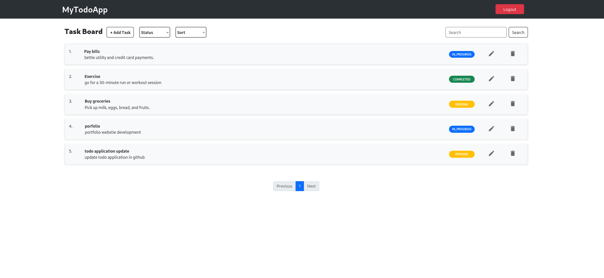
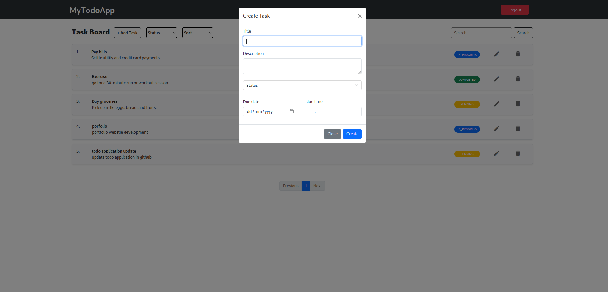
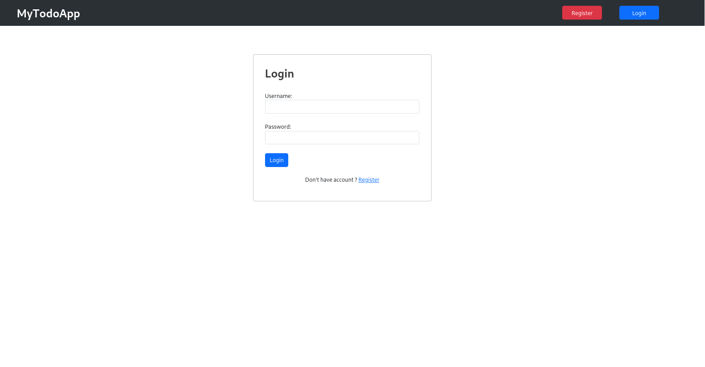
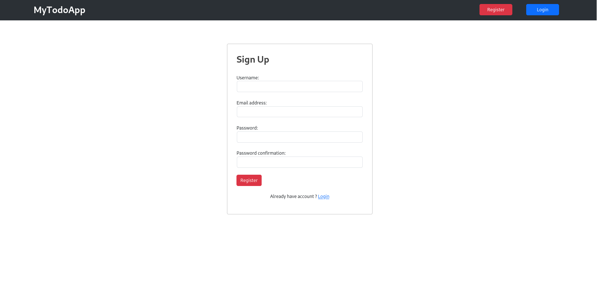

# To-Do Application
A simple web application built using Django that allows users to manage tasks in the form of to-dos. The application provides functionality to create, read, update, and delete tasks, offering a straightforward task management system.

## Key Features

- **User Authentication**: Users can sign up, log in, and manage their to-do lists securely with Django’s built-in authentication system.
- **Task Management**: Users can add new tasks, mark them as completed, or delete them as needed.
- **Task Status**: Each task can be marked as "Pending" or "Completed," and the user can filter tasks based on their status.
- **Searching and Sorting** : User can search tasks by Status or any keywords and can sort the tasks by Created at or updated at.
- **Simple Interface**: The user interface is minimalistic and easy to navigate, focusing on simplicity and functionality.

## Technologies Used:

- **Django**: For backend development, providing a robust framework for handling the app’s structure, routing, and database management.
- **SQLite**: The default database used for storing user data and to-do tasks.
- **HTML/CSS**: For frontend structure and styling to create a clean, responsive interface.

## Screenshots

